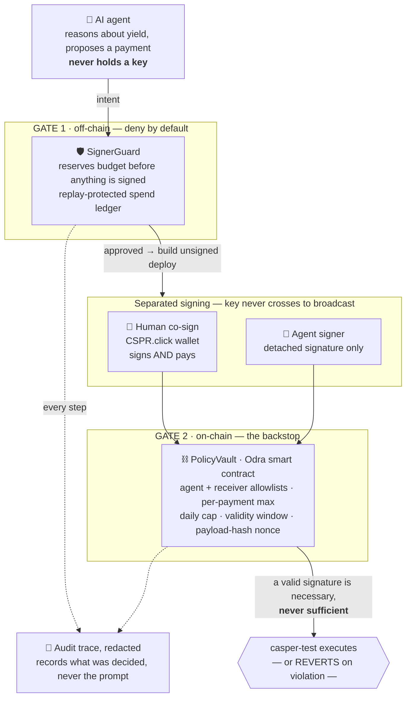

<div align="center">

# Caspilot

### An autonomous DeFi agent for Casper that **cannot run away with your money**.

*AI proposes &nbsp;·&nbsp; the signer & on-chain vault authorize &nbsp;·&nbsp; the chain executes.*

[](https://testnet.cspr.live)
[](docs/tier1-demo.md)
[](#quickstart)
[](#license)

Casper Agentic Buildathon 2026 · Casper Innovation Track

📺 **[Demo video](#demo-video)** &nbsp;·&nbsp; 🔗 **[On-chain proof](#the-headline-this-is-real-and-you-can-check-it-yourself)** &nbsp;·&nbsp; 🛡️ **[Security model](#security-model)** &nbsp;·&nbsp; ⚡ **[Quickstart](#quickstart)**

</div>

---

## The headline: this is real, and you can check it yourself

Caspilot's core claim — *an on-chain policy gate that stops a misbehaving agent* — is **proven on casper-test and permanently verifiable on a block explorer**. No rebuild, no trust in us. Look any hash up on [`testnet.cspr.live`](https://testnet.cspr.live):

| Step | Result | Hash | On-chain outcome |
|---|---|---|---|
| Deploy PolicyVault | ✅ installed | [`bf555d60…5431`](https://testnet.cspr.live/deploy/bf555d60bcbb3b9375d8281f32dceb86523fd0b5103ea11f409838ab3f2d5431) | contract [`8f75ba25…d63e`](https://testnet.cspr.live/contract/8f75ba257f61ae1bbfa1f974a617705e519757445a77189d7c011327bdc5d63e) |
| `pay()` **accepted** | ✅ transfer | [`a7419aa2…2bdf5`](https://testnet.cspr.live/deploy/a7419aa2fcedff56b76fe509ecc745b9f1da0ecd5b26e0205a0241061242bdf5) | 50 tokens → allowlisted receiver |
| `pay()` **rejected** — receiver not allowed | ⛔ reverted | [`e6801a75…cec7`](https://testnet.cspr.live/deploy/e6801a750b58bbe955240b0fef19e53ced76219be397043bb1f56e03280bcec7) | `User error: 3` (`ReceiverNotAllowed`) |
| `pay()` **rejected** — over per-payment max | ⛔ reverted | [`c4a48997…0eea`](https://testnet.cspr.live/deploy/c4a48997dfcd7c56c2d019caaa771467f71d48d50ca85584218fb2a9327a0eea) | `User error: 4` (`AmountAboveMax`) |
| **UI co-sign** — human signs + pays, backend-verified | ✅ finalized | [`299d1288…fe7543`](https://testnet.cspr.live/transaction/299d1288e7edfed64e1de6ca9d229834b02f2de22d75999b59a09b5403fe7543) | native CSPR transfer · `signerRole: user_cspr_click` |

A genuine policy gate must do more than let a good payment through — it must **stop** the bad ones on-chain, where the agent cannot override it. Two correctly-signed, correctly-formed payments were reverted **purely because they violated policy**. That is the whole thesis, on-chain. The last row is proof of a different kind: a real transaction a human **co-signed and paid straight from the web UI**, which the backend independently verified on-chain before recording it.

Full walkthrough, trust model, and reproduce steps → **[`docs/tier1-demo.md`](docs/tier1-demo.md)**.

---

## The problem

Autonomous agents that touch money are a security nightmare. To act, an agent usually needs a key — and a key is unbounded authority. If the model is jailbroken, hallucinates a recipient, or is simply wrong, *nothing on-chain stops it*. "Trust the prompt" is not a security model.

## The solution

**Caspilot splits the agent's intelligence from its authority.** The agent can *reason* about yield and *propose* a payment, but it never holds a key and can never move funds on its own. Every payment passes through two independent gates it cannot bypass:

1. **An off-chain SignerGuard** — deny-by-default policy checks + a SQLite spend-ledger that *reserves* budget before anything is signed (replay-protected, daily-capped).
2. **An on-chain PolicyVault** — an Odra smart contract that re-checks *every* `pay()` against an agent allowlist, a receiver allowlist, a per-payment max, a daily cap, a validity window, and a payload-hash nonce — and reverts if any fails.

> **AI proposes; signer & vault authorize; chain executes.** The vault's allowlisted agent is bound to the *signer's own derived account hash* — so on-chain authority follows the key that actually signs, not a value the caller passes in.

Caspilot ships this as **two product lines over one backend**:

- 💸 **An x402-paid agent API** — pay-per-call yield intelligence, settled with the x402 payment protocol (CEP-18 + EIP-712 authorization) and a replay-protected ledger.
- 🔐 **A delegated on-chain PolicyVault** — deposit funds, set the rules, and let the agent operate *within* them. The chain is the backstop.

---

## How it works



In the codebase: **apps/web** (Next.js) creates intents and drives CSPR.click signing; **apps/api** (Hono) runs the intent FSM, the x402 gateway, and the redacted audit trace; **apps/harness** broadcasts and observes on casper-test.

The agent's only path to the chain is a **detached, tagged signature** over a byte-identical deploy. The signing key is loaded by the signer and never crosses into the broadcast adapter. Even with a valid signature, the vault still has the final say.

> 📄 The full one-page value proposition (for judges): **[`docs/value-proposition.md`](docs/value-proposition.md)**.

---

## Tech stack

| Layer | Choice |
|---|---|
| Smart contract | **Odra 2.0** (Rust → WASM), CEP-18 token transfers |
| Backend API | **Hono** + `@hono/node-server`, TypeScript (strict, NodeNext) |
| Web | **Next.js 14** App Router, React 18, a hand-rolled `design-system.css` (no Tailwind) |
| Payments | **x402** protocol (verify/settle/supported wire schemas, `PAYMENT-SIGNATURE` codec) |
| Ledgers | **SQLite** via better-sqlite3 (WAL), `UNIQUE` replay constraints |
| Chain access | casper-js-sdk against a **casper-2.0 (Condor)** testnet node |
| Monorepo | pnpm workspace · vitest · biome · GitHub Actions CI |

**788 automated tests** across 12 workspaces, plus a Rust contract suite and a gated real-broadcast live runner.

---

## Quickstart

> Prerequisites: **Node ≥ 20.10** (CI runs Node 22), **pnpm 9.12**, and — for the contract — the Rust/Odra toolchain (see [`docs/development-status.md`](docs/development-status.md#toolchain)).

```bash
pnpm install          # installs the workspace (better-sqlite3 builds natively)
pnpm typecheck        # strict TS across every package
pnpm test             # 788 tests (the 2 real-broadcast tests self-skip)
```

### Verify the contract logic

```bash
node scripts/check-cargo.mjs   # cargo odra test -b casper && cargo odra build
```

### Run the web UI locally

```bash
pnpm --filter api dev          # API on http://localhost:8787
pnpm --filter web dev          # Web on http://localhost:3001
```

Open <http://localhost:3001> → **Intents** to draft a payment intent and **Intent detail** to watch its (redacted) audit trace.

> **Note (honest status):** the production API entrypoint (`apps/api/src/index.ts`) serves the full `/intents` lifecycle — create, list, validate-policy, mark-executed, trace, and reject — alongside `/healthz` and `/version`, persisting the ledger and audit trace to SQLite (`CASPILOT_DB_PATH`). The API carries a **non-broadcasting `local_dev` signer** (its `sign()` throws): it never holds a real signing key, so on-chain broadcast stays the harness's job. Host setup — persistent volume, env, CORS — is in [`docs/deploy-vercel.md`](docs/deploy-vercel.md#enabling-the-live-api). The Tier-1 proof above is **independent of any hosting** — the deploy hashes are permanent on-chain.

### Reproduce the on-chain proof (optional, spends test-CSPR)

Opt-in, **casper-test only**, gated behind `RUN_REAL_ONCHAIN=1`. Full env and command in [`docs/tier1-demo.md`](docs/tier1-demo.md#reproduce-it-live-optional).

---

## Security model

Defense-in-depth is the point of this project, not an afterthought:

- **Key separation** — the agent/API never holds the signing key; only a detached signature crosses the trust boundary into the broadcast adapter.
- **Deny-by-default** — SignerGuard rejects anything not explicitly allowed; denial paths never reach the signer.
- **On-chain backstop** — the PolicyVault re-validates every `pay()`; a valid signature is necessary but not sufficient.
- **No secrets in the browser** — `validatePublicEnv()` rejects privileged `NEXT_PUBLIC_*` names, and a build-time gate (`scripts/check-bundle-secrets.mjs`) scans the real `.next` bundle for leak shapes *and* live secret values.
- **User signs, not the server** — the only web signer is CSPR.click; any provider exposing privileged fields is rejected.
- **Audit trace, not chain-of-thought** — reasoning/prompts are redacted before persistence and re-redacted on export. The trace records *what was decided*, never the model's private reasoning.
- **Replay protection everywhere** — `UNIQUE(nonce,payer,asset)` and `UNIQUE(payload_hash)` in the payment ledger; `UNIQUE(intent_id)` reservations in the spend ledger; payload-hash nonces on-chain.

---

## Repository layout

```
caspilot/
├── apps/
│   ├── api/            Hono API — intent FSM, x402 gateway, audit trace
│   ├── web/            Next.js 14 UI (Vercel-ready)
│   ├── harness/        Tier-1 real-broadcast orchestrator (casper-test)
│   └── adapter-doctor/ adapter capability/health checks
├── packages/
│   ├── intent-fsm/     canonical states + deny-by-default transitions
│   ├── signer-guard/   policy checks + SQLite spend ledger
│   ├── x402-gateway/   x402 wire schemas + PAYMENT-SIGNATURE codec
│   ├── payment-ledger/ replay-protected SQLite ledger
│   ├── adapters/       casper-rpc / CEP-18 / CSPR.cloud / write path
│   ├── audit-trace/    reasoning redactor + store
│   └── shared/         canonical JSON / SHA-256 helpers
├── contracts/
│   └── policy-vault/   the Odra smart contract (the on-chain gate)
└── docs/
    ├── tier1-demo.md          ← the verifiable on-chain proof
    ├── deploy-vercel.md       ← deployment guide
    ├── demo-recording.md      ← demo-video runbook
    └── development-status.md  ← detailed phase-by-phase build log
```

---

## Roadmap

- ✅ **Tier-1 (mandatory)** — on-chain PolicyVault enforcement proven on casper-test, sealed into a schema-valid artifact.
- ✅ **Live API** — `index.ts` assembles `IntentRouterDeps` via `buildApiDeps`, so the full intent lifecycle serves over HTTP (see deploy guide).
- ⏭️ **Step-by-step FSM** — replace the `mark-executed` demo fast-forward with the full intermediate state walk.
- ⏭️ **Reservation sweeper** — wire `releaseExpired()` to a background job so abandoned reservations free budget.
- ⏭️ **Tier-2/3** — multi-step yield strategies, more adapters, mainnet hardening.

**Where this goes.** The primitive Caspilot proves — *an autonomous agent whose authority is bounded by an on-chain policy it cannot override* — is the missing trust layer for the agent economy. The same SignerGuard + PolicyVault pattern generalizes directly to the buildathon's DeFi and RWA themes: autonomous treasury management, policy-gated RWA settlement, and machine-to-machine commerce where agents transact continuously but can never exceed the rules their owner deposited on-chain.

---

## Documentation

- 🔗 **[On-chain proof (Tier-1)](docs/tier1-demo.md)** — the headline, block-explorer verifiable.
- 🚀 **[Vercel deployment guide](docs/deploy-vercel.md)** — what goes on Vercel, what doesn't, and why.
- 🎬 **[Demo-video runbook](docs/demo-recording.md)** — shot list + narration for recording the demo.
- 🛠️ **[Engineering status log](docs/development-status.md)** — every phase, every deviation, every compat fix.

## Demo video

> 📺 **Watch the walkthrough (3m44s):** _YouTube link added on publish._

A single end-to-end take: drafting a payment intent in the console → policy validation → a **human co-sign from the CSPR.click wallet** that pays from the user's own funds → the backend **independently verifying the deploy on-chain** before recording it → the public `testnet.cspr.live` explorer showing the finalized transfer → two **on-chain rejections** (`User error: 3` / `User error: 4`) where the vault stops policy-violating payments → the full **788-test suite** running green → the open-source repo and architecture.

## License

MIT — see [`LICENSE`](LICENSE). Open-source and public, as required by the buildathon.
