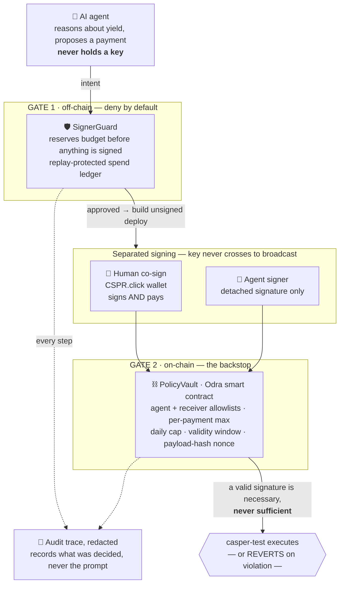

# Caspilot — value proposition (one page for judges)

> **AI will eventually move money on its own. The only question is: who can stop it.**
> Caspilot turns the chain into that brake — *a valid signature is necessary, but never sufficient.*

---

## The problem, in one breath

To act, an autonomous agent needs a key. **A key is unbounded authority.** If the model is jailbroken, hallucinates a receiver, or is simply wrong, nothing on-chain stops it. "Trust the prompt" is not a security model — and it is the model almost every agent ships with today.

## The insight

**Intelligence is not authority.** Caspilot lets the agent *reason* about yield and *propose* a payment, but it never holds a key and can never move funds alone. Every payment crosses **two independent gates it cannot bypass** — one off-chain, one on-chain — and the signing key never travels with the agent.

---

## The trust architecture

**Read it in one line:** the agent proposes → the SignerGuard reserves and approves → a signature is produced *separately* (the human co-signs and pays from their own wallet, or the agent signer emits a detached signature) → the on-chain PolicyVault re-checks the payment and **reverts if it breaks policy** → only finalized success is recorded to the audit trace.

---

## Why a judge can trust this — it is on-chain, and you can check it yourself

Nothing below requires trusting us. Every hash resolves on [`testnet.cspr.live`](https://testnet.cspr.live).

| What it proves | On casper-test |
|---|---|
| **A human can co-sign + pay a real payment, triggered from our UI** — backend independently verifies finality before recording it | tx [`299d1288…fe7543`](https://testnet.cspr.live/transaction/299d1288e7edfed64e1de6ca9d229834b02f2de22d75999b59a09b5403fe7543) · `signerRole: user_cspr_click` · `approval: human_cosign` |
| **The on-chain gate STOPS a bad payment — wrong receiver** | [`e6801a75…cec7`](https://testnet.cspr.live/deploy/e6801a750b58bbe955240b0fef19e53ced76219be397043bb1f56e03280bcec7) — reverted `User error: 3 ReceiverNotAllowed` |
| **The on-chain gate STOPS a bad payment — over the per-payment max** | [`c4a48997…0eea`](https://testnet.cspr.live/deploy/c4a48997dfcd7c56c2d019caaa771467f71d48d50ca85584218fb2a9327a0eea) — reverted `User error: 4 AmountAboveMax` |
| **A good payment still goes through** | [`a7419aa2…2bdf5`](https://testnet.cspr.live/deploy/a7419aa2fcedff56b76fe509ecc745b9f1da0ecd5b26e0205a0241061242bdf5) — 50 tokens → allowlisted receiver |

The two **reversions** are the heart of it: two correctly-signed, correctly-formed payments were rejected on-chain **purely because they violated policy** — exactly where the agent cannot override. A gate that only lets good payments through is not a gate; a gate that stops the bad ones, on a chain the agent does not control, is.

> **Honest boundary.** Seeded demo intents that show `EXECUTED` carry synthetic hashes for UI legibility and are **not** claimed as real chain proof. The real, independently-verifiable proofs are exactly the hashes above. The vault's daily cap shown in the demo is a config value chosen for legibility; the reserve/commit ledger underneath it is real.

---

## What this brings to the Casper ecosystem

| | |
|---|---|
| **Fills a category gap** | Bounded, *provable* agent-payment safety — not "an agent with a key," but an agent whose authority is fenced by an on-chain contract it cannot bypass. |
| **Casper-native, end to end** | Casper 2.0 `TransactionV1`, native CSPR **and** CEP-18 paths, an Odra/Rust→WASM PolicyVault, and CSPR.click human co-signing — exercising the real 2026 stack, not a mock. |
| **Reusable scaffold** | SignerGuard + spend-ledger + PolicyVault is a drop-in pattern any Casper agent project can adopt to make autonomy safe. |
| **The agentic-payments narrative** | Demonstrates *how* AI agents can safely transact on Casper — the exact story the Agentic Buildathon is asking the ecosystem to tell. |

---

**In one line:** Caspilot is the proof that an AI agent can be powerful *and* unable to run away with your money — because on Casper, the chain itself is the brake.
